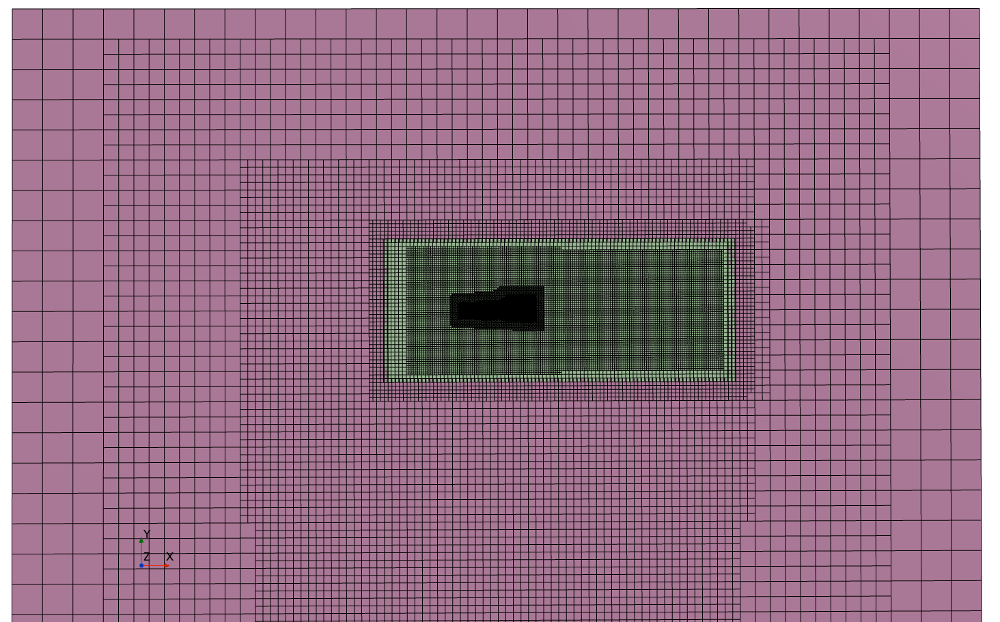
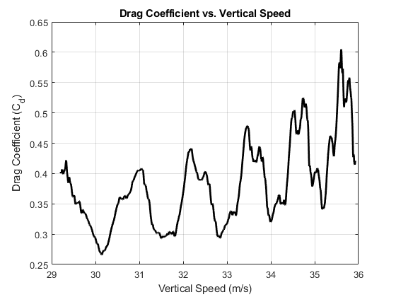
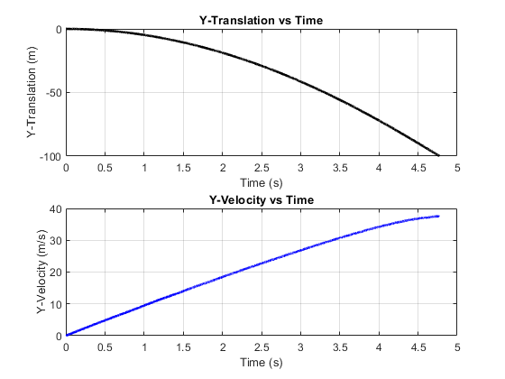
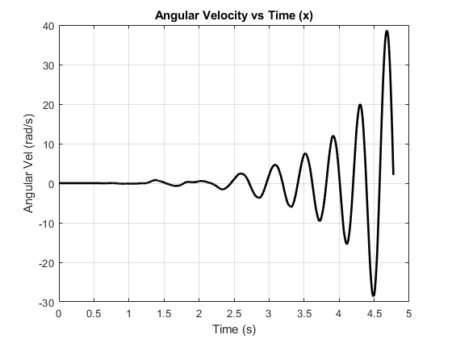
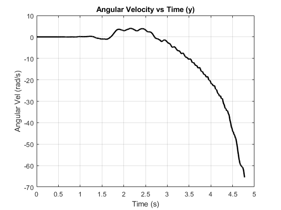
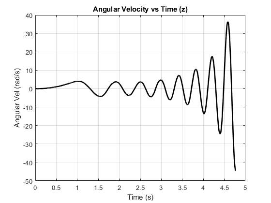

# Nerf-Football-DFBI-Full-6-Degrees-of-Freedom

A 6 degrees of freedom (6-DOF) simulation using Dynamic Fluid Body Interaction (DFBI) methodology for analyzing a Nerf football's motion in fluid environments.

## Overview

This simulation captures the motion of a rigid body subject to fluid forces, tracking both translational and rotational dynamics across all six degrees of freedom:
- **Translation**: X, Y, Z displacement

## Simulation Scenario

The Nerf football is released horizontally and allowed to fall under gravity in a quiescent fluid environment.

- **Initial Condition**: Horizontal release with zero initial velocity at 100 meters height from the ground
- **Aerodynamic Stabilization**: Fins at the rear create restoring moments
- **Natural Orientation**: Football rotates to minimize drag and achieve stable vertical fall
- **Gravity Effects**: Constant downward acceleration drives the motion
- **Fluid Coupling**: Real-time computation of aerodynamic forces and moments

The simulation demonstrates how the football's geometry and fin design create inherent stability, causing it to self-orient for optimal aerodynamic performance during freefall.

### Mesh Visualization

*Computational domain and mesh used for the simulation*

## Results

### Coefficient of Drag

*Time history of drag coefficient showing flow development*

### Translational Motion

### Rotational Motion
| X-Angular Velocity | Y-Angular Velocity | Z-Angular Velocity |
|:--:|:--:|:--:|
|  |  |  |

*Angular velocity components showing rotational dynamics*

### Animation

*Complete 6-DOF motion visualization*

## Simulation Details

### Methodology
- DFBI (Dynamic Fluid Body Interaction)
- **Degrees of Freedom**: 6 (3 translational + 3 rotational)
